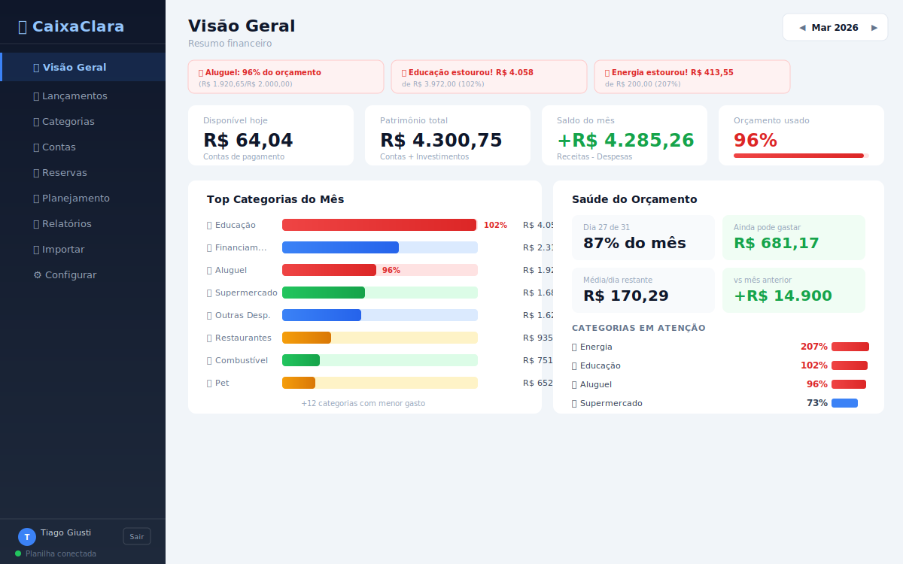
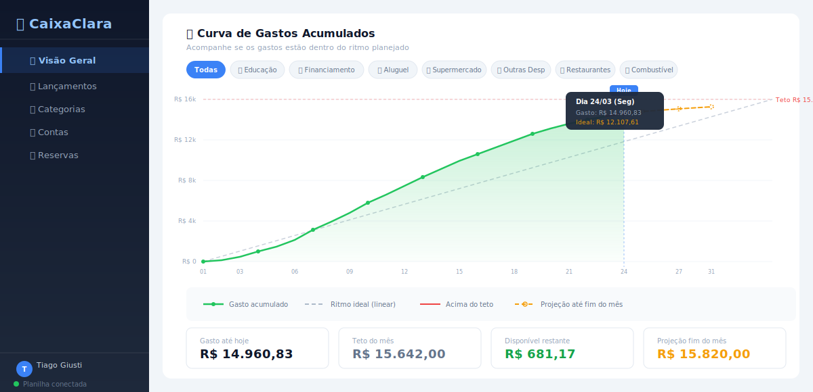

# 💰 CaixaClara

**Gestão financeira familiar simples e inteligente.** Controle contas, lançamentos, orçamentos e metas em um único lugar — com dados armazenados no Google Sheets e acesso protegido por login com Google.



## O que faz

CaixaClara é um app web completo para gerenciar finanças pessoais e familiares:

- **Dashboard consolidado** com saldos, gastos por categoria, alertas de orçamento e projeções
- **Curva de gastos acumulados** — visualize o ritmo de gastos vs. orçamento planejado, com projeção até o fim do mês
- **Importação de extratos** bancários (CSV/Excel/PDF) com classificação automática em 6 etapas
- **Tetos orçamentários** por categoria com alertas visuais quando estiver perto do limite
- **Metas financeiras** (reserva de emergência, viagem, etc.) com acompanhamento de progresso
- **Relatórios** com evolução diária, fluxo de caixa e comparativo mensal
- **Múltiplas contas** — conta corrente, poupança, cartão de crédito, investimentos
- **Acesso protegido** com Google Sign-In (apenas membros autorizados da família)



## Stack

| Camada | Tecnologia |
|--------|-----------|
| Frontend | React 18 (SPA servida como HTML estático) |
| Backend | Node.js + Express |
| Banco de dados | Google Sheets (via Google Apps Script + Sheets API) |
| Autenticação | Google Sign-In (Identity Services) + JWT |
| Classificação | Motor próprio de 6 etapas para categorizar transações |
| Deploy | Render (web service gratuito) |

## Estrutura do projeto

```
CaixaClara/
  server.js              # Servidor Express (API REST + auth middleware)
  setup-sheets.js        # Script de inicialização das abas do Google Sheets
  package.json           # Dependências Node.js
  render.yaml            # Configuração de deploy no Render
  Code.gs                # Backend via Google Apps Script
  public/
    index.html           # Frontend React completo (SPA)
    config.js            # Configuração local (URL do Apps Script)
  services/
    auth.js              # Autenticação (Google Sign-In + JWT + whitelist)
    sheets.js            # Camada de acesso ao Google Sheets
    classifier.js        # Classificador automático de transações
    importer.js          # Importador de extratos CSV/Excel
    projections.js       # Projeções de gastos para fim de mês
  google-apps-script/
    Code.gs              # Código do Apps Script (CRUD da planilha)
  importers/             # Parsers específicos por banco/formato
  docs/                  # Mockups e documentação visual
```

## Configuração

### Pré-requisitos

1. **Node.js** 18 ou superior
2. **Conta Google** com uma planilha criada no Google Sheets
3. **Service Account** no Google Cloud com acesso à planilha
4. **OAuth Client ID** para Google Sign-In (produção)

### 1. Clonar e instalar

```bash
git clone https://github.com/giustin/caixaclara.git
cd caixaclara
npm install
```

### 2. Criar a Service Account no Google Cloud

1. Acesse o [Google Cloud Console](https://console.cloud.google.com/)
2. Crie um projeto (ou use um existente)
3. Ative a **Google Sheets API**
4. Vá em **IAM & Admin > Service Accounts** e crie uma nova service account
5. Gere uma chave JSON para essa service account
6. Compartilhe sua planilha do Google Sheets com o email da service account (permissão de Editor)

### 3. Configurar variáveis de ambiente

Crie um arquivo `.env` na raiz do projeto:

```env
# Google Sheets (obrigatório)
GOOGLE_SPREADSHEET_ID=id_da_sua_planilha
GOOGLE_SERVICE_ACCOUNT_EMAIL=email_da_service_account
GOOGLE_PRIVATE_KEY=chave_privada_da_service_account

# Autenticação (opcional em dev — se não configurar, o auth fica desabilitado)
GOOGLE_CLIENT_ID=seu_oauth_client_id
JWT_SECRET=string_secreta_para_tokens
ALLOWED_EMAILS=email1@gmail.com,email2@gmail.com

# Apps Script URL (opcional em dev — pode usar config.js local)
APPS_SCRIPT_URL=https://script.google.com/macros/s/.../exec

PORT=3000
```

O ID da planilha está na URL dela: `https://docs.google.com/spreadsheets/d/ESTE_E_O_ID/edit`

### 4. Inicializar e rodar

```bash
npm run setup   # Cria as abas e categorias padrão no Google Sheets
npm start       # Inicia o servidor na porta 3000
```

Acesse `http://localhost:3000` no navegador. Sem `GOOGLE_CLIENT_ID` configurado, o app roda em modo aberto (sem tela de login) — ideal para desenvolvimento.

## Deploy no Render

1. Faça push deste repositório no GitHub
2. Crie uma conta em [render.com](https://render.com)
3. Clique em **New > Web Service** e conecte seu repositório
4. O Render detecta automaticamente o `render.yaml`
5. Adicione as variáveis de ambiente no painel do Render:

| Variável | Descrição |
|----------|-----------|
| `GOOGLE_SPREADSHEET_ID` | ID da planilha |
| `GOOGLE_SERVICE_ACCOUNT_EMAIL` | Email da service account |
| `GOOGLE_PRIVATE_KEY` | Chave privada da service account |
| `GOOGLE_CLIENT_ID` | OAuth Client ID (ativa o login) |
| `JWT_SECRET` | Segredo para tokens JWT (`openssl rand -hex 32`) |
| `ALLOWED_EMAILS` | Emails autorizados, separados por vírgula |
| `APPS_SCRIPT_URL` | URL do deploy do Google Apps Script |

O app estará disponível em `https://caixaclara.onrender.com`.

**Nota:** No plano gratuito, o servidor adormece após 15 minutos sem uso e demora ~30s para acordar.

## Autenticação

O CaixaClara usa **Google Sign-In** para proteger o acesso:

1. Usuário clica em "Entrar com Google" na tela de login
2. Google retorna um ID Token
3. Backend valida o token e verifica se o email está na whitelist (`ALLOWED_EMAILS`)
4. Se autorizado, gera um **JWT** com validade de 24h
5. Todas as rotas da API ficam protegidas pelo middleware de autenticação

Para criar o OAuth Client ID: Google Cloud Console > APIs & Services > Credentials > Create Credentials > OAuth client ID (tipo Web Application). Adicione as URLs do Render e `http://localhost:3000` em "Authorized JavaScript origins".

## API

Rotas de autenticação (públicas):

| Método | Rota | Descrição |
|--------|------|-----------|
| POST | `/api/auth/login` | Login com token Google, retorna JWT |
| GET | `/api/auth/me` | Dados do usuário logado |
| GET | `/api/auth/config` | Configuração de auth para o frontend |

Rotas protegidas (requerem JWT):

| Método | Rota | Descrição |
|--------|------|-----------|
| GET | `/api/dashboard` | Dados consolidados do mês atual |
| GET | `/api/lancamentos` | Listar lançamentos (com filtros) |
| POST | `/api/lancamentos` | Criar lançamento |
| GET | `/api/contas` | Listar contas |
| GET | `/api/saldos` | Saldos atuais |
| GET | `/api/categorias` | Listar categorias |
| GET | `/api/tetos` | Tetos orçamentários |
| GET | `/api/metas` | Metas financeiras |
| GET | `/api/alertas` | Alertas de orçamento |
| POST | `/api/importar` | Importar extrato (CSV/Excel) |
| POST | `/api/classificar` | Classificar transação |
| GET | `/api/projecoes` | Projeções de fim de mês |

## Segurança

Consulte [SEGURANCA.md](SEGURANCA.md) para detalhes sobre credenciais, variáveis de ambiente e boas práticas. Nunca suba `.env` ou chaves de service account para o repositório.

## Licença

Projeto pessoal. Uso livre.
